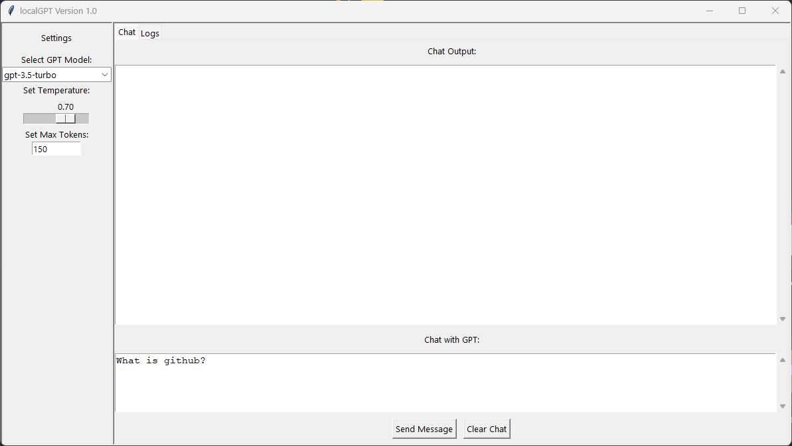
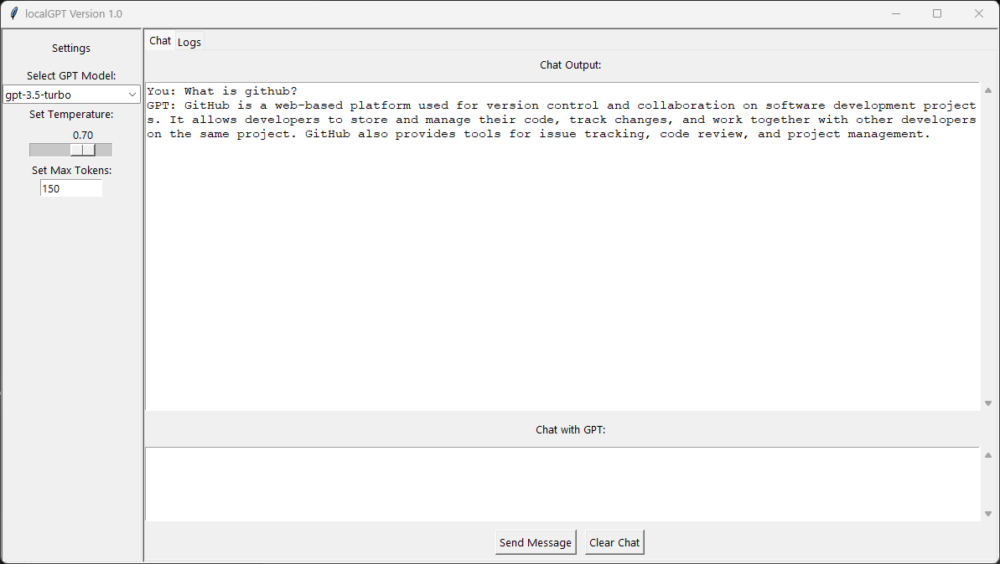
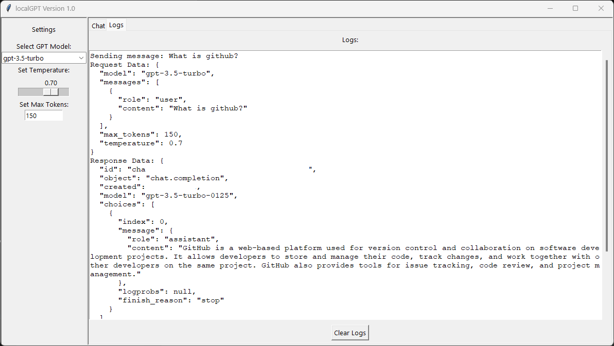

# OpenAI GPT GUI
###### this GUI is not provided by Openai!
OpenAi GPT GUI is a minimalist, multiplatform tool for interacting with OpenAI's GPT models. The application allows you to send text messages to the GPT API and receive responses. It provides a simple graphical user interface (GUI) built with Tkinter, which can be easily customized or extended to suit specific needs. 

## Table of Contents
1. [Introduction](#introduction)
2. [Philosophy](#philosophy)
3. [Features](#features)
4. [Requirements](#requirements)
5. [Installation](#installation)
6. [Usage](#usage)
7. [Screenshot](#screenshot)
8. [Contributing](#contributing)
9. [Acknowledgments](#acknowledgments)
10. [License](#license)


## Philosophy

The motivation behind this GUI is to maintain a minimalist approach when interacting with the GPT API. The goal is to avoid the necessity of installing large packages, whether through Docker, npm, or other frameworks, which can be cumbersome and time-consuming. In an age where complexity often overshadows simplicity, LocalGPT strives to remain lightweight and easily extensible. This application serves as a foundational base, easily adaptable for creating desktop applications with interfaces for GPT APIs, especially useful for client projects.

## Features

- Communicate with various GPT models including GPT-4, GPT-3.5-turbo, and others.
- Simple and intuitive graphical user interface.
- Clear chat history and log output functionalities.
- Adjustable settings for model selection, temperature, and max tokens.

## Requirements

- Python 3.x
- `requests` library
- `tkinter` library (usually included with Python installations)

## Installation

1. **Clone the repository or download the project files**:
2. **Install required libraries**:
 ```
   pip install requests
```

3. **Prepare the settings**:
   - Create a `settings.json` file in the project directory or rename examples to `settings.json`.
   - Use the following structure for the settings file
  
##### Windows
```
     {
       "working_directory": "C:\\path\\to\\working\\directory",
       "openai_api_key": "your_openai_api_key_here"
     }
```
##### Linux/Unix 
```
     {
       "working_directory": "/path/to/working/directory",
       "openai_api_key": "your_openai_api_key_here"
     }
 ```


## Usage

1. **Run the application**:
```
   python localGPT.py
```

2. **Settings Tab**:
   - **Select GPT Model**: Choose the desired GPT model from the dropdown menu.
   - **Set Temperature**: Adjust the temperature slider to control the randomness of the output.
   - **Set Max Tokens**: Specify the maximum number of tokens for the response.

3. **Chat Tab**:
   - **Chat Output**: View the conversation with the GPT model.
   - **Chat with GPT**: Type your message in the input box.
   - **Send Message**: Click the "Send Message" button to send your message to the GPT model.
   - **Clear Chat**: Click the "Clear Chat" button to clear the chat history.

4. **Logs Tab**:
   - **Logs**: View detailed logs of the API requests and responses.
   - **Clear Logs**: Click the "Clear Logs" button to clear the log history.

## Screenshot
##### Input

##### Output

##### Logview



## Contributing

Contributions are welcome! Please open an issue or submit a pull request for any enhancements or bug fixes.

## Acknowledgments

- This project uses the OpenAI GPT API.
- Special thanks the community for their support and feedback.

## Your Support
If you find this project useful and want to support it, there are several ways to do so:

- If you find the white paper helpful, please ⭐ it on GitHub. This helps make the project more visible and reach more people.
- Become a Follower: If you're interested in updates and future improvements, please follow my GitHub account. This way you'll always stay up-to-date.
- Learn more about my work: I invite you to check out all of my work on GitHub and visit my developer site https://volkansah.github.io. Here you will find detailed information about me and my projects.
- Share the project: If you know someone who could benefit from this project, please share it. The more people who can use it, the better.
**If you appreciate my work and would like to support it, please visit my [GitHub Sponsor page](https://github.com/sponsors/volkansah). Any type of support is warmly welcomed and helps me to further improve and expand my work.**

Thank you for your support! ❤️
###### Copyright S. Volkan Kücükbudak

### License
This project is licensed under the  GPL-3.0  License. See the [LICENSE](LICENSE) file for details.


